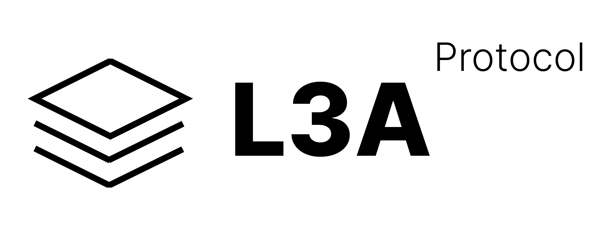

# L3 Atom
A massive cryptocurrency data lake and analytics platform.

## Table of Contents
- [Background](#background)
- [Setup](#setup)
- [Schemas](#schemas)

## Why L3 Atom?
L3 Atom is a comprehensive data platform that has been built from the ground up for scale and cloud-native architectures. It provides low-latency and real-time access to cryptocurrency data from both off-chain and on-chain sources, standardising and packaging the data into atomic events that can be easily transported and stored in virtually any format and data store thanks to an integration with an Apache Kafka back-end.

For off-chain data, the following exchanges are supported:
 - Binance
 - Binance Futures
 - Bitfinex
 - Bybit
 - Coinbase
 - Deribit
 - FTX
 - Gemini
 - Kraken
 - Kraken Futures
 - Phemex

For on-chain data, the following DeFi protocols are supported:

**Ethereum**
 - Curve Finance
 - Dodoex
 - Hashflow
 - Sushiswap
 - Uniswap V2
 - Uniswap V3

L3 Atom is also hosted as a **free** managed service where you can tap into crypto market data via our Websocket API, or analyse historical data via our query tool. View the documentation [here](https://gda-fund.gitbook.io/l3-atom-v3-documentation/).